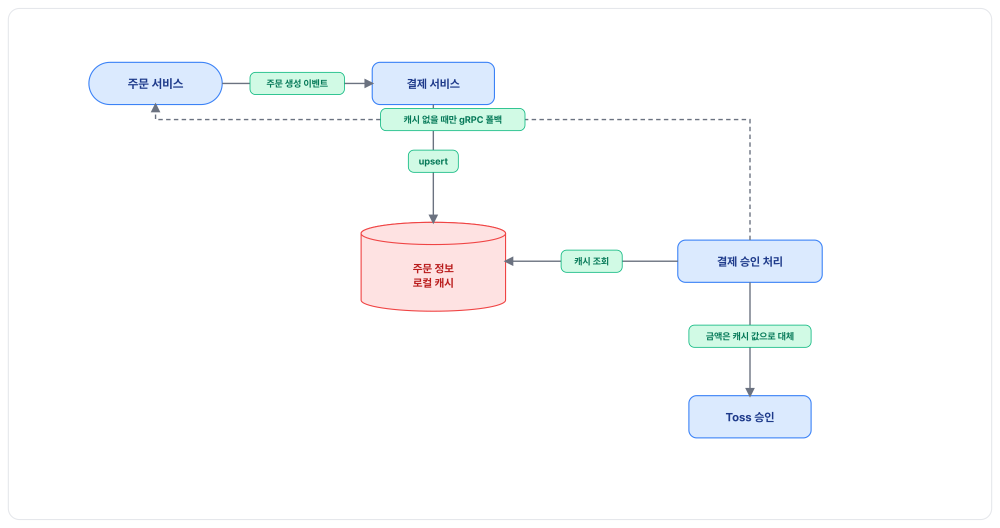
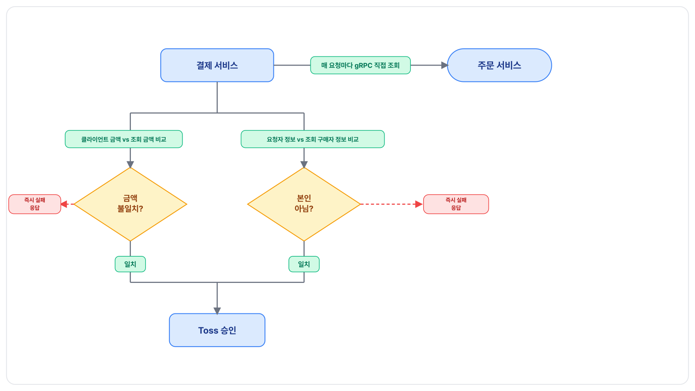

결제 승인 처리가 주문의 금액·구매자를 검증하는 방법을 로컬 캐시에서 매 요청 gRPC 직접 조회로 바꾼 작업입니다. 주문 서비스 데이터를 로컬에 복제해두는 캐시를 만들어 두었다가, 그 복제 구조의 문제점을 확인하고 캐시를 통째로 걷어내 매 요청 gRPC 직접 조회로 전환했습니다.

## 문제 정의

재설계 이전의 결제 승인 처리는 두 가지를 검증 없이 그대로 받아들였습니다.

- **금액**: 클라이언트가 보낸 결제 금액을 아무 확인 없이 그대로 Toss로 전달해, 금액의 진실 공급원이 사실상 클라이언트인 구조였습니다. 프론트엔드 버그나 조작된 요청으로 실제 주문 금액과 다른 값이 오더라도 서버는 이를 걸러낼 방법이 없었습니다.
- **구매자**: 결제 승인 요청자가 실제 그 주문의 구매자인지 확인하는 절차가 없었습니다. 주문 식별자와 결제 키만 알면 다른 사람의 주문도 결제 승인을 시도할 수 있는 구조였습니다.

두 문제 모두 원인이 같았습니다. 서버 쪽에 주문에 대한 독립적인 진실 공급원이 없었습니다. 그래서 이 작업의 실제 논점은 "검증 로직을 추가한다"가 아니라, "무엇을 기준(source)으로 검증할지를 먼저 정한다"였습니다.

## 해결 방안 비교 및 선택 이유

### 방안 A — 주문 정보 로컬 캐시 (먼저 도입)

주문 서비스가 발행하는 주문 생성 이벤트를 이벤트 컨슈머가 구독해 로컬 캐시 테이블에 미리 채워두고, 결제 승인 시점엔 이 로컬 스냅샷만 조회하는 방식입니다. 이벤트가 아직 도착하지 않았을 때만 gRPC로 폴백해 즉시 채워넣는 두 갈래 경로였습니다.

스냅샷을 유일한 진실 공급원으로 삼았기 때문에, 금액 검증은 하지 않았습니다. 클라이언트 요청에서 금액 필드 자체를 완전히 제거하고, 스냅샷에 저장된 금액을 그대로 썼습니다. 구매자 검증은 요청 헤더로 전달받는 사용자 식별자를 스냅샷에 저장된 구매자 정보와 비교했습니다.

### 방안 A의 문제

이 로컬 캐시는 주문 서비스의 데이터를 결제 서비스 내부에 그대로 복제해둔 사본입니다. 이 복제 구조는 세 가지 문제를 낳았습니다.

- **강결합**: 결제 서비스가 주문 서비스의 데이터 구조를 알게되었습니다. 주문 서비스가 이벤트 payload의 필드를 바꾸거나 발행 시점을 바꾸면, 결제 서비스의 캐시 테이블과 그걸 채우는 소비 로직도 함께 따라 바뀌어야 합니다.
- **최신성**: 주문 정보가 바뀌면 결제 서비스에서 알 수 없어 업데이트할 수 없습니다.
- **동시성**: 이벤트 중복 도착이나 이벤트·gRPC 두 경로의 동시 쓰기처럼 고려해야 할 경쟁조건이 많았습니다.

### 방안 B — 매 요청 gRPC 직접조회 (재설계)

로컬 복제를 없애고, 결제 승인 처리가 호출될 때마다 주문 서비스를 gRPC로 직접 조회해 그 시점의 금액·구매자 정보를 받습니다. 그리고 클라이언트 요청에 금액을 다시 받되, 이번엔 그 값을 신뢰하지 않고 조회 결과와 비교하는 검증 대상으로 다룹니다. 구매자 확인도 같은 조회 결과의 구매자 정보와 비교합니다.

### 뒷받침 결정 — 금액을 다시 받기로 한 이유

어차피 매 요청마다 주문 서비스를 직접 조회하게 됐으니, A처럼 서버가 가진 값으로 조용히 대체할 수도 있었습니다. 하지만 그렇게 하면 클라이언트가 실제로 어떤 금액을 인지하고 있었는지에 대한 신호가 사라집니다. 클라이언트 값을 다시 받아 명시적으로 비교하면, 프론트엔드 버그나 화면-서버 금액 불일치를 관측 가능한 에러 신호로 드러낼 수 있습니다.

## 문제 해결 과정

방안 A(로컬 캐시)의 문제를 확인하여 방안 B(매 요청 gRPC 직접 조회) 재설계 하였습니다.

1. 결제 승인 처리 로직을 매 요청 gRPC 조회로 작성
2. 도메인 엔티티·리포지토리·영속성 어댑터, 그리고 이벤트 컨슈머의 캐시 저장 경로 등 로컬 캐시 관련 코드 전부 제거

## 결과

- **구조적**: 로컬 캐시 엔티티·리포지토리·영속성 어댑터, 그리고 이를 채우기 위한 두 갈래 쓰기 경로(이벤트 소비 + gRPC 폴백)와 그 경쟁조건 방어 코드가 전부 사라졌습니다. 
- **트레이드오프**: gRPC 호출에는 아직 회복탄력성 계층이 없어, 주문 서비스 장애 상황에서의 대응은 현재 "즉시 실패, 재시도는 클라이언트에 맡긴다" 수준에 머물러 있습니다.

