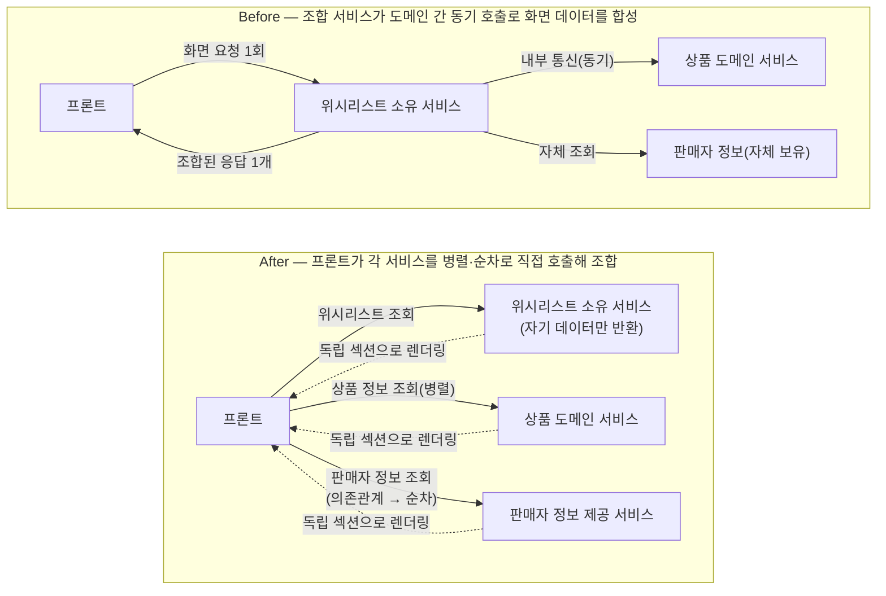

특정 마이크로 서비스 하나가 화면에 필요한 데이터를 모으기 위해 다른 도메인 서비스를 내부 통신으로 직접 호출해 조합하던 패턴이 여러 지점에서 반복적으로 나타났습니다. 이 패턴을, 프론트가 각 서비스의 API를 병렬(또는 의존관계가 있는 구간만 순차)로 호출해 조합하는 방식으로 재설계한 작업입니다.

## 문제 정의

위시리스트 화면에서 필요한 데이터(위시리스트 항목·상품 정보·판매자 정보)는 위시리스트·상품·판매자 세 도메인에 걸쳐 있었습니다. 그런데 이 조합을 담당한 지점은 위시리스트 데이터를 소유한 서비스 하나였습니다. 이 서비스가 자신이 가진 위시리스트 엔티티를 조회한 뒤, 상품 서비스를 내부 통신으로 직접 호출해 상품 정보를 끌어왔습니다. 여기에 자신이 가진 판매자 정보까지 얹어, 화면에 필요한 응답 하나를 완성해 반환하는 구조였습니다.

이 구조를 검토하며 확인한 문제는 세 가지였습니다.

(1) 위시리스트를 소유한 서비스가 상품 서비스의 데이터 형태와 계약까지 알아야 했습니다. 이는 자신의 책임 범위를 넘어선 지식을 갖게 되는 경계 문제였습니다.

(2) 상품 서비스 호출이 순차 동기로 걸려 있어 그 응답 시간이 그대로 위시리스트 응답 시간에 누적됐습니다.

(3) 상품 서비스 호출 하나가 실패하면 위시리스트 자체 데이터는 문제가 없어도 화면 전체 응답이 실패로 처리됐습니다. 이는 무관한 데이터의 장애가 전체 실패로 번지는 구조였습니다.

## 해결 방안 비교 및 선택 이유

**후보 A: 비동기·논블로킹 전환 —** 위시리스트 소유 서비스가 상품 서비스를 논블로킹으로 호출하도록 바꾸는 방향을 검토했습니다. 하지만 이는 스레드 점유 문제만 완화할 뿐, 조합 지점이 여러 서비스의 계약을 알아야 하는 결합 문제와 장애 전파 문제는 그대로 남습니다. 게다가 상품 정보를 먼저 조회해야 그 결과의 판매자ID로 판매자 정보를 조회할 수 있는 것처럼 데이터 의존관계가 있는 호출은, 비동기로 바꿔도 그 두 호출 사이의 순차 대기 자체가 없어지지 않습니다. 결국 서비스를 여러 개로 나눈 이유(독립 배포·장애 격리)가 이런 조합 지점에서 다시 무너진다는 점이 반려의 핵심 근거였습니다.

**후보 B: BFF 신설 —** 조합 책임을 별도 계층으로 뽑아내는 BFF는 결합 문제를 가장 근본적으로 해소하는 방향이었습니다. 하지만 이 시점 인프라는 medium·large 인스턴스 단 2대로 이미 여러 서비스를 나눠 쓰고 있었고, 여기에 조합 전용 서비스를 하나 더 얹을 여유가 없었습니다. 방향성 자체를 기각한 것이 아니라, 지금 확보된 인프라로는 실행할 수 없다고 보고 추후 과제로 남겼습니다.

**후보 C: 프론트 병렬 조합(채택) —** 추가 서버 없이도 조합 지점 자체를 없앨 수 있는 방법이었습니다. 위시리스트 소유 서비스와 상품 도메인 서비스는 서로 데이터 의존관계가 없으므로 프론트에서 병렬로 호출하고, 상품→판매자처럼 실제로 순서가 필요한 구간만 순차 호출을 유지하되 독립된 화면 섹션으로 분리해, 그 구간의 실패나 지연이 다른 섹션까지 끌고 내려가지 않게 했습니다.

## 문제 해결 과정

재설계는 위시리스트 화면을 대표 사례로 삼아 진행했습니다. 위시리스트를 소유한 서비스에서 상품 서비스를 호출해 데이터를 합성하던 로직을 제거하고, 그 서비스는 자신이 소유한 데이터만 응답하도록 범위를 좁혔습니다.

상품 정보와 판매자 정보는 프론트가 각 서비스의 API를 직접 호출해 화면에서 조합하도록 흐름을 옮겼습니다. 이 과정에서 상품→판매자처럼 의존관계가 있는 호출은 프론트에서도 순차 호출이 불가피하다는 점을 그대로 인정하고, 대신 그 구간을 독립적으로 렌더링되는 섹션으로 분리해 장애·지연이 다른 데이터 표시를 막지 않게 했습니다.

같은 문제 인식을 이 화면 하나에 국한하지 않고, 팀 차원에서 "화면 데이터 조합은 백엔드 한 지점이 아니라 프론트가 맡는다"는 설계 원칙으로 정리했습니다. 이 원칙에 따라 구매한 상품 화면에서도 동일한 패턴(주문·상품·판매자 데이터를 한 서비스가 모아 응답하던 구조)을 같은 방식으로 다시 설계했습니다.

## 결과

서버 간 동기 호출 체인을 제거하면서 조합 지점의 결합도·경계 침범 문제와, 무관한 데이터까지 끌고 내려가던 장애 전파 문제를 구조적으로 해소했습니다. 

동시에 조합 책임이 사라진 것이 아니라 백엔드에서 프론트로 옮겨졌을 뿐이라는 점은 그대로 남는 트레이드오프입니다. 프론트는 여러 서비스에 대한 병렬 요청 관리와, 섹션별 로딩·부분 실패 처리라는 복잡도를 새로 떠안게 됐습니다. 상품→판매자처럼 의존관계가 있는 구간은 여전히 순차 호출이라는 본질이 남아 있어 그 구간의 지연 자체는 해소되지 않았습니다. BFF는 인프라 자원 부족으로 보류된 상태이며, 여유가 확보되는 시점에 조합 책임을 다시 서버 사이드로 가져오는 재검토가 필요합니다.