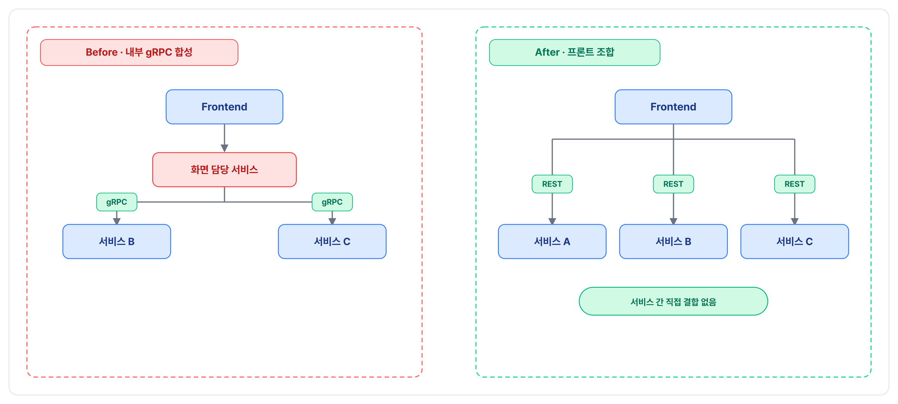

기존에 특정 서비스 하나가 화면에 필요한 데이터를 모으기 위해 다른 도메인 서비스를 호출해 조합하던 패턴이 여러 지점에서 반복적으로 나타났습니다. 이 패턴을 프론트가 데이터를 가지고 있는 각 서비스로 API를 병렬 호출해 조합하는 방식으로 재설계한 작업입니다.

## 문제 정의

어떤 서비스가 자신이 가진 데이터를 조회한 뒤, 다른 도메인의 데이터를 가진 서비스를 내부 통신으로 직접 호출해 가져오고, 여기에 자신의 데이터까지 합쳐 화면에 필요한 응답 하나로 만들어 반환하는 구조였습니다. 문제는 화면에 필요한 데이터가 여러 도메인에 걸쳐 있는데도, 이 조합 역할이 그중 한 데이터를 가진 서비스 하나에 고정되어 있었다는 점입니다.

이 구조를 검토하며 확인한 문제는 세 가지였습니다.

1. 조합을 담당하던 서비스가 자신의 책임 범위를 넘어, 다른 도메인 서비스의 데이터 형태와 계약까지 알아야 했습니다.
2. 다른 도메인 서비스를 순차 동기로 호출하기 때문에, 그 응답 시간이 그대로 화면 응답 시간에 누적됐습니다.
3. 다른 도메인 서비스 호출 하나가 실패하면, 조합을 담당하던 서비스 자체 데이터는 문제가 없어도 화면 전체 응답이 실패로 처리됐습니다. 무관한 데이터 장애가 전체 실패로 번지는 구조인 셈입니다.

## 해결 방안 비교 및 선택 이유

### 후보 A: 비동기·논블로킹 전환

조합을 담당하던 서비스가 연관 도메인 서비스를 논블로킹으로 호출하도록 바꾸는 방향을 검토했습니다. 하지만 이는 스레드 점유 문제만 완화할 뿐, 조합 지점이 여러 서비스의 계약을 알아야 하는 결합 문제와 장애 전파 문제는 그대로 남습니다.

### 후보 B: BFF 서버 도입

데이터 조합을 별도 계층으로 뽑아내는 BFF 서버는 결합 문제를 가장 근본적으로 해결하는 방향입니다. 하지만 이 시점 인프라는 medium·large 인스턴스 단 2대로 이미 여러 서비스를 나눠 쓰고 있어, BFF 서버를 도입할 여유가 없었습니다. 추후 인프라 자원이 확보되면 재검토할 계획입니다.

### 후보 C: 프론트 병렬 조합(채택)

추가 서버 없이도 조합 지점 자체를 없앨 수 있는 방법입니다. 데이터를 가지고 있는 각 서비스로 프론트에서 병렬 호출하도록 했습니다. 또한 독립된 화면 섹션으로 나눠, 한쪽이 실패해도 나머지 화면은 정상적으로 보이도록 장애를 격리했습니다.

## 문제 해결 과정

데이터 조합을 담당하던 서비스에서 다른 도메인 서비스를 호출해 데이터를 조합하던 로직을 제거하고, 자신이 소유한 데이터와 관련된 요청만 응답하도록 범위를 좁혔습니다.

또한 나머지 데이터는 프론트가 각 서비스의 API를 직접 호출하여 화면에서 조합하도록 변경했습니다. 이 과정에서 의존관계가 있는 호출은 프론트에서도 순차 호출이 되도록 하였습니다.

## 결과

하나의 서비스에서 데이터를 조합하던 패턴을 제거하면서, 그 패턴에서 비롯된 데이터 결합도·장애 전파 문제를 구조적으로 해소했습니다.

하지만 조합 책임이 백엔드에서 프론트로 옮겨졌을 뿐이며, 이는 그대로 남는 트레이드오프입니다. 프론트는 여러 서비스에 대한 병렬 요청 관리와, 섹션별 로딩·부분 실패 처리 등으로 복잡도가 늘어났습니다. 인프라 자원에 여유가 생기면, 조합 책임을 다시 서버 사이드(BFF)로 가져오는 재검토가 필요합니다.
