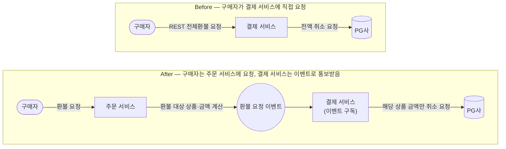

## 문제 정의

기존 환불 기능은 구매자가 결제 서비스의 환불 API를 직접 호출해 결제 건 전체를 한 번에 환불하는 REST API 하나로만 구현되어 있었습니다. 그런데 상품 단위로 나눠서 환불할 수 있어야 한다는 요구사항이 새로 생겼습니다.

이 문제는 단순히 부분 금액을 받는 파라미터를 추가하는 정도로 해결되지 않았습니다. 상품별로 얼마를 환불해야 하는지 결정하는 데 필요한 정보(상품별 가격, 주문 내 취소 가능 여부 등)가 애초에 결제 서비스에는 없고 주문 서비스에만 있었기 때문입니다. 즉 환불 여부와 금액을 계산하는 책임이 결제 서비스 바깥에 있는데, API는 여전히 구매자가 결제 서비스에 직접 요청하는 형태로 남아 있었다는 것이 실제 문제였습니다.

## 해결 방안 비교 및 선택 이유

### 중심 결정 — 환불 요청을 받는 대상을 결제 서비스에서 주문 서비스로 옮김

환불을 요청하는 주체는 여전히 구매자입니다. 다만 결제 건 전체가 아니라 상품 단위로 환불하려면 "어떤 상품을 얼마나 환불할지"를 아는 쪽이 그 요청을 받아야 하는데, 그 정보는 주문 서비스에 있습니다. 그래서 구매자가 결제 서비스를 직접 호출하던 것을, 주문 서비스가 먼저 요청을 받아 환불 대상과 금액을 계산한 뒤 그 결과를 결제 서비스에 이벤트로 통보하는 구조로 바꿨습니다.

### 뒷받침 결정 — 동기 호출이 아니라 이벤트로 통보받음

주문 서비스가 결제 서비스에 알려주는 방법도 두 가지였습니다. 주문 서비스가 결제 서비스를 동기로 호출하거나, 이벤트를 발행하고 결제 서비스가 구독하는 것이었습니다. 결제 승인은 구매자가 화면에서 결과를 기다리기 때문에 동기 처리가 필요하지만, 환불은 구매자가 그 자리에서 즉시 응답을 받아야 하는 흐름이 아니라 사후 처리로 봐도 무방하다고 판단했습니다. 그래서 비동기로 가기로 했고, 서비스 간 비동기 통신은 이미 Kafka 기반 이벤트 방식으로 표준화되어 있었으므로 그 표준을 그대로 따랐습니다.

## 문제 해결 과정

위 결정들을 계획 문서로 정리한 뒤, 기존 REST 전체환불 기능(엔드포인트, 유스케이스, 서비스, 커맨드)을 코드베이스에서 완전히 제거하는 작업을 먼저 진행했습니다.

이어서 이벤트 기반 환불 처리를 구현했습니다. 주문 서비스가 발행하는 환불 요청 이벤트의 payload, 이를 구독하는 Kafka 컨슈머, 실제 환불 로직을 처리하는 서비스, Toss 환불 연동을 순서대로 만들었습니다.

마지막으로 통합 테스트로 상품 단위 부분환불 흐름 전체가 실제로 동작하는지 검증했습니다.

## 결과

- **결과 1 (기능적)**: 이전에는 결제 건 전체를 한 번에 환불하는 것만 가능했지만, 이제는 주문 내 상품 단위로 나눠 환불할 수 있게 됐습니다.
- **결과 2 (구조적)**: 트리거가 이벤트 소비로 바뀌면서 결과를 기다리는 HTTP 호출자 자체가 사라졌고, 처리 중 상태·폴링·재시도 스케줄러를 모두 제거해 하나의 트랜잭션 안에서 완결되는 구조로 단순화됐습니다.
- **결과 3 (책임 분리)**: 결제 서비스는 상품별 가격이나 주문 내 취소 가능 여부 같은 주문 도메인 정보를 몰라도, 이벤트로 전달받은 환불 금액만 보고 그대로 처리하면 되는 구조가 됐습니다.

