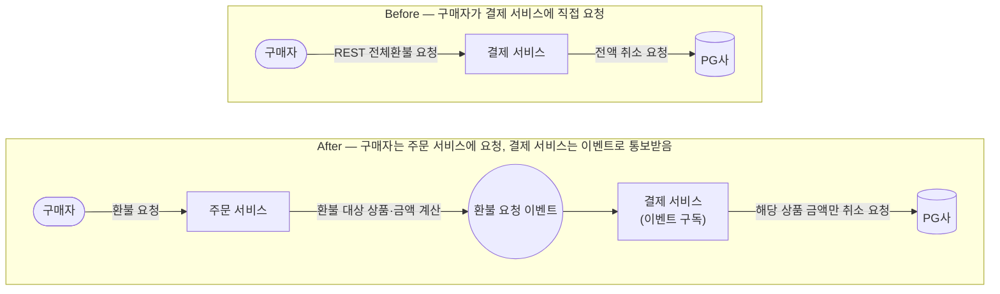

## 문제 정의

기존 환불 흐름은 구매자가 결제 서비스에 환불을 요청하면 결제 건 전체를 한 번에 환불하는 방식이었습니다. 그런데 이후 상품 단위로 나눠 환불하는 부분 환불 기능이 필요해졌습니다.

상품별로 얼마를 환불해야 하는지 결정하는 데 필요한 정보(상품별 가격, 주문 내 취소 가능 여부 등)는 애초에 결제 서비스가 아니라 주문 서비스에만 있었습니다. 즉 환불 여부와 금액을 계산하는 책임은 결제 서비스 바깥에 있는데, 요청은 여전히 결제 서비스가 직접 받는 구조였던 것입니다.

## 해결 방안 비교 및 선택 이유

### 중심 결정: 환불 요청을 받는 대상을 결제 서비스에서 주문 서비스로 옮김

상품 단위로 환불하려면 "어떤 상품을 얼마나 환불할지"를 아는 쪽이 그 요청을 받아야 합니다. 그래서 구매자가 결제 서비스를 직접 호출하던 구조를, 주문 서비스가 먼저 요청을 받아 환불 대상과 금액을 계산한 뒤 그 결과를 결제 서비스에 이벤트로 통보하는 구조로 바꿨습니다.

```mermaid
flowchart TB
    subgraph Before["Before — 구매자가 결제 서비스에 직접 요청"]
        direction LR
        B1(["구매자"]) -- "REST 전체환불 요청" --> B2["결제 서비스"]
        B2 -- "전액 취소 요청" --> B3[("PG사")]
    end

    subgraph After["After — 구매자는 주문 서비스에 요청, 결제 서비스는 이벤트로 통보받음"]
        direction LR
        A1(["구매자"]) -- "환불 요청" --> A2["주문 서비스"]
        A2 -- "환불 대상 상품·금액 계산" --> A3(("환불 요청 이벤트"))
        A3 --> A4["결제 서비스\n(이벤트 구독)"]
        A4 -- "해당 상품 금액만 취소 요청" --> A5[("PG사")]
    end

    Before ~~~ After
```

### 뒷받침 결정: 이벤트로 통보받음

주문 서비스가 결제 서비스에 알리는 방법은 동기 호출과 이벤트 발행(구독) 두 가지였습니다. 결제는 구매자가 화면에서 결과를 기다리므로 동기 처리가 필요하지만, 환불은 사후에 처리해도 무방하다고 판단해 비동기 방식을 택했습니다. 서비스 간 비동기 통신은 Kafka 기반 이벤트 방식을 따랐습니다.

## 문제 해결 과정

기존 REST 전체환불 기능을 제거하는 작업을 먼저 진행했습니다. 이어서 이벤트 기반 부분환불 처리를 구현했습니다. 주문 서비스가 발행하는 환불 요청 이벤트의 payload, 이를 구독하는 Kafka 컨슈머, 실제 환불을 처리하는 로직, Toss 환불 연동을 만들었습니다.

마지막으로 단위 테스트와 통합 테스트로 상품 단위 부분환불 흐름 전체가 동작하는지 검증했습니다.

## 결과

- 이전에는 결제 건 전체를 한 번에 환불하는 것만 가능했지만, 이제는 상품 단위로 나눠 환불할 수 있게 됐습니다.
- 트리거가 이벤트 소비로 바뀌면서 결과를 기다리는 HTTP 호출자 자체가 사라졌고, 처리 중 상태·폴링·재시도 스케줄러를 모두 제거해 하나의 트랜잭션 안에서 완결되는 구조로 단순화됐습니다.
- 결제 서비스는 상품별 가격이나 주문 내 취소 가능 여부 같은 주문 도메인 정보를 몰라도, 이벤트로 전달받은 환불 금액만 보고 그대로 처리하면 되는 구조가 됐습니다.

