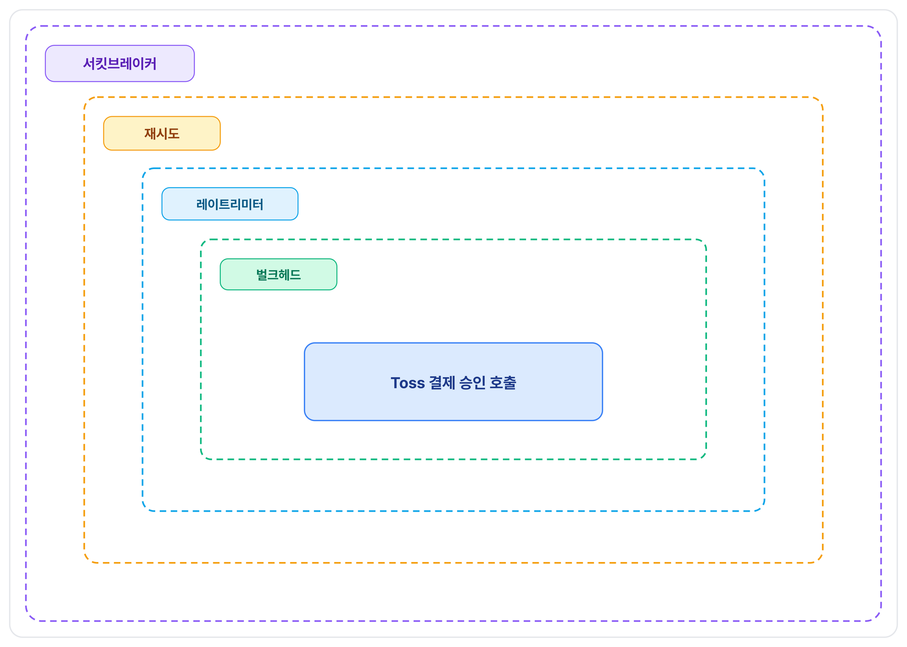

## 문제 정의

결제 승인 요청은 결제 게이트웨이 클라이언트가 Toss 결제 승인 API를 호출해 처리합니다. 이 호출은 커넥션 풀링이 없어 요청마다 연결을 새로 맺는 순수 blocking 방식입니다. 그래서 Toss가 느려지거나 5xx를 반복하면, 요청을 처리하던 Tomcat worker 스레드가 응답이 돌아올 때까지 그대로 점유됩니다.

이 점유는 결제 승인 API 하나의 문제로 끝나지 않습니다. 결제 승인 엔드포인트는 하나뿐이지만, 커스텀 설정 없이 Tomcat 기본 스레드 풀(200개)을 그대로 쓰고 있어 승인 요청이 스레드를 다수 점유하면 같은 풀을 쓰는 다른 API 처리까지 지연됩니다.

## 해결 방안 비교 및 선택 이유

resilience4j 기반으로 서킷브레이커·벌크헤드·레이트리미터·재시도 네 계층을 차례로 도입했습니다. 각 계층을 도입한 구체적인 이유는 아래와 같습니다.

### 계층별 도입 이유

- **서킷브레이커**: Toss가 느려지거나 5xx를 반복해도 매 요청이 그대로 Toss를 다시 호출해, 실패가 거의 확정적인 호출에도 스레드를 계속 점유합니다. 반복되는 실패를 감지해 이후 호출 자체를 차단할 장치가 필요했습니다.
- **벌크헤드**: 서킷브레이커는 최근 호출 실패율을 보고 "다음 호출을 막을지"를 판단하는 장치라, 실패율 계산에 필요한 최소 호출 건수(10건)가 쌓이기 전까지는 Toss가 이미 느려지고 있어도 호출을 그대로 통과시킵니다. 이 관찰 구간 동안 동시 결제 승인 요청이 몰리면 스레드 점유가 누적되므로, 서킷브레이커 하나만으로는 스레드 고갈을 막지 못합니다.
- **레이트리미터**: Toss 아웃바운드 호출 빈도를 제한할 필요가 있었습니다. 클라이언트별 인바운드 요청 제한은 API Gateway가 이미 다른 서비스와 공유해 처리 중인 관심사라 범위에서 제외하고, Toss 아웃바운드 호출 빈도 하나로 좁혔습니다.
- **재시도**: 앞선 세 장치(서킷브레이커·벌크헤드·레이트리미터)가 순간적인 연결 실패나 Toss 5xx를 재시도 없이 곧바로 사용자 실패로 반환했고, 그 실패가 서킷브레이커 실패율 집계에도 그대로 들어가 서킷브레이커가 필요 이상으로 쉽게 열릴 수 있었습니다.

### 중심 결정 — 결합 순서

최종 구조는 `서킷브레이커(재시도(레이트리미터(벌크헤드(호출))))`입니다. "이미 실패가 확정된 호출에게 뒤쪽(안쪽)의 더 비싼 자원을 낭비시키지 않는다"는 하나의 원칙을, 계층이 추가될 때마다 경계 하나씩에 다시 적용한 결과입니다.

- **서킷브레이커가 제일 바깥인 이유**: 서킷브레이커가 OPEN이면 이 호출은 Toss 근처도 안 갈 게 확정입니다. 재시도나 레이트리미터를 서킷브레이커보다 바깥에 두면 OPEN 상태에서도 그 로직이 실행돼 버려질 호출이 재시도 예산·유량 예산을 갉아먹습니다. 서킷브레이커를 제일 바깥에 두면 OPEN 동안 안쪽 로직 자체가 호출되지 않아 이 문제가 없습니다.
- **재시도를 서킷브레이커 바로 안쪽에 둔 것이 네 계층 조합에서 가장 핵심적인 결정**: 이렇게 하면 재시도 전체(원 시도 + 재시도)가 서킷브레이커 관점에서는 "결과 1건"으로만 기록됩니다. 반대로 재시도를 서킷브레이커 바깥에 두면 재시도의 각 시도가 서킷브레이커 슬라이딩 윈도우에 개별로 기록돼 오히려 실패율 계산에 더 많이 잡히고 서킷브레이커가 더 쉽게 열립니다.
- **레이트리미터가 벌크헤드보다 바깥인 이유**: 순서를 반대로 하면 호출이 먼저 벌크헤드 동시성 슬롯(20개 중 1개)을 잡은 뒤에야 레이트리미터 검사를 받습니다. 레이트리미터가 거절하면 그 호출은 Toss에 가지 않았는데도 슬롯을 잠깐 점유했다 반납한 셈이 되어, 버스트 상황에서 진짜 통과해야 할 호출이 슬롯 부족으로 밀려날 수 있습니다.
- **레이트리미터·벌크헤드 거절은 재시도 대상에서 제외하고, 서킷브레이커 실패 집계에서도 제외**: 둘 다 Toss 장애가 아니라 우리 쪽이 스스로 건 상한에 걸린 것이라, 즉시 재시도해도 상황이 바뀌지 않고 이미 포화된 자원에 요청을 한 번 더 얹는 셈이라 무의미합니다. 이 제외 목록에서 빠뜨리면 이 자원 보호 동작이 실제 Toss 장애처럼 서킷브레이커 실패율에 섞여 불필요하게 OPEN될 수 있습니다.

### 뒷받침 결정 1 — 세마포어 방식 벌크헤드 vs 전용 스레드풀 방식 벌크헤드

결제 게이트웨이 호출은 커넥션 풀링 없는 단순 blocking 호출이라, 어떤 방식을 쓰든 "Toss 응답을 기다리는 시간" 자체는 없어지지 않습니다. 전용 스레드풀 방식을 쓰려면 별도 스레드 풀에 호출을 위임해야 하는데, 결제 승인 응답을 동기로 유지하는 한 그 결과를 받는 시점에 결국 어딘가에서 다시 동기적으로 블로킹해야 합니다. 이 경우 Tomcat 스레드(결과 대기)와 벌크헤드 전용 스레드(실제 호출 수행)가 동시에 점유돼, 같은 일을 처리하는 데 스레드를 2배 쓰면서 격리 이득은 추가로 없습니다. 그래서 Tomcat worker 스레드가 대기를 그대로 수행하되 동시에 몇 개까지 허용할지만 카운터로 제한하는 세마포어 방식을 택했습니다.

### 뒷받침 결정 2 — 로컬 레이트리미터 vs 분산(Redis) 레이트리미터, 그리고 알려진 한계

레이트리미터가 지키려는 것은 "이 서비스가 Toss로 내보내는 결제 승인 호출의 총량"이고, 이를 내보내는 서버가 1대뿐이라 로컬 카운터를 택했습니다.  만약 추후에 서버가 2대 이상으로 늘어나면 Redis 기반 분산 레이트리미터로 전환할 계획입니다.

### 뒷받침 결정 3 — 재시도 대상에서 순수 타임아웃 제외

재시도는 연결 레벨 실패(연결 거부·리셋 등)와 Toss 5xx만 대상으로 하고, readTimeout(60초) 소진으로 인한 순수 타임아웃은 재시도하지 않습니다. 이미 60초를 기다린 뒤라 또 재시도하면 최악의 경우 사용자가 120초를 기다려야 하는데, 이는 "사용자 체감 실패 줄이기"라는 이번 작업의 목표와 정면으로 상충하기 때문입니다.

## 문제 해결 과정

서킷브레이커 → 벌크헤드 → 레이트리미터 → 재시도는 이 순서대로, 매 단계 계획 문서 작성 → 구현이 반복하였습니다.

레이트리미터 단계에서는 설정값을 잡기 전에 Toss의 실제 quota를 먼저 조사했습니다. Toss 공식 개발자 문서를 확인한 결과 결제 승인 API 문서 자체에는 rate limit·TPS·429 관련 언급이 없었고, 429 언급은 거래조회 등 조회 계열 API에만 있었습니다. 즉 이 작업은 "실제 관측된 429 초과 이력"에 대응한 게 아니라, 결제 도메인 특성상(429 한 번이 사용자 결제 실패로 직결) 확인되지 않은 리스크에 대한 선제적 방어였다는 점을 설정값 산정 근거로 그대로 남겼습니다.

## 결과

- **서킷브레이커**: 도입 전에는 Toss 장애 중에도 매 요청이 계속 Toss를 호출해 그대로 스레드를 점유했습니다. 도입 후에는 실패율이 임계치(최근 20건 중 50%)를 넘으면 즉시 OPEN되어, 이후 요청은 Toss를 전혀 타지 않고 실패를 즉시 반환합니다 — 실패가 거의 확정적인 상황에서의 스레드 점유 자체가 없어졌습니다.
- **벌크헤드**: 동시 확인 요청이 몰려도 최대 20건으로 상한이 걸려, Tomcat 기본 스레드 풀(200개)의 90%(180개)는 항상 다른 처리에 남는다는 것이 설계상 산술적으로 보장됩니다.
- **레이트리미터**: Toss 아웃바운드 호출이 초당 30건으로 상한이 걸려, 문서화되지 않은 Toss quota를 초과해 429가 발생할 리스크를 선제적으로 차단합니다.
- **재시도**: 순간적인 연결 실패·5xx가 사용자에게 즉시 실패로 노출되지 않고 500ms 후 1회 재시도로 흡수됩니다. 동시에 이 재시도 전체가 서킷브레이커 관점에서는 "결과 1건"으로만 집계되도록 설계해, 재시도 도입 자체가 서킷브레이커를 더 쉽게 열리게 만드는 부작용을 없앴습니다.

이 이점들은 설계 시점 계산과 테스트로 검증된 것이며, 실제 트래픽에서의 효과(서킷 OPEN 빈도, 벌크헤드 포화 방지 횟수 등)를 관측할 모니터링 체계는 아직 없어 실측 근거는 후속 과제로 남아 있습니다.
