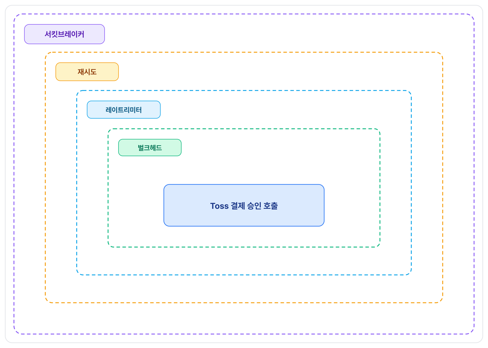

## 문제 정의

결제 승인 요청은 결제 게이트웨이(PG)의 결제 승인 API를 호출해 처리합니다. 이 호출은 응답이 올 때까지 그 자리에서 그대로 기다리는 방식입니다. 그래서 PG가 느려지거나 5xx번대 에러가 반복되면, 요청을 처리하던 스레드가 응답이 돌아올 때까지 그대로 점유되는 문제가 발생합니다.

이 문제는 결제 승인 API 하나로 끝나지 않습니다. 현재 커스텀 설정 없이 기본 스레드 풀(200개)를 그대로 쓰고 있어 결제 승인 요청이 스레드를 다수 점유하면 같은 풀을 공유하는 다른 API 처리까지 지연됩니다.

## 해결 방안 비교 및 선택 이유

문제를 해결하기 위해 resilience4j 라이브러리 기반으로 서킷브레이커·벌크헤드·레이트리미터·재시도 네 계층을 도입했습니다. 각 계층을 도입한 이유는 아래와 같습니다.

### 계층별 도입 이유

- **서킷브레이커**: PG가 느려지거나 5xx번대 에러가 반복돼도 매 요청이 PG를 호출해, 실패가 거의 확정적인 호출에도 스레드를 계속 점유합니다. 따라서 반복되는 실패를 감지해 이후 호출 자체를 차단할 장치가 필요했습니다.
- **벌크헤드**: 서킷브레이커는 실패율 계산이 필요한 최소 호출 건수가 쌓이기 전까지 PG가 이미 느려지고 있어도 호출을 그대로 통과시킵니다. 그래서 이 구간 동안 결제 승인 요청이 몰리면 스레드 점유가 누적되므로, 동시 호출 수 자체를 제한해 스레드 점유 누적을 막는 장치가 필요했습니다.
- **레이트리미터**: PG 아웃바운드 호출 빈도를 제한하면, 트래픽이 몰릴 때 PG의 rate limit을 넘어서서 요청 한도 초과 오류가 발생하는 상황을 막을 수 있습니다. 결제 도메인 특성상 요청 한도 초과 오류 한 번이 곧바로 사용자 결제 실패로 이어지므로, 이 리스크를 사전에 차단하는 장치가 필요했습니다.
- **재시도**: 순간적인 연결 실패나 PG 5xx가 재시도 없이 곧바로 사용자 실패로 반환되고, 그 실패가 서킷브레이커 실패율 집계에도 그대로 들어가 서킷브레이커가 필요 이상으로 쉽게 열릴 수 있다는 문제가 있었습니다. 이를 예방하기 위해 순간적인 실패를 흡수하는 장치가 필요했습니다.

### 호출 순서 설계

호출 순서는 `서킷브레이커(재시도(레이트리미터(벌크헤드(호출))))`입니다. "이미 실패가 확정된 호출은 안쪽의 더 비싼 자원을 낭비시키지 않는다"는 원칙으로 순서를 정했습니다.

- **서킷브레이커가 제일 바깥인 이유**: 서킷브레이커가 열리면 이 호출은 PG를 호출하지 않습니다. 재시도나 레이트리미터를 서킷브레이커보다 바깥에 두면 열린 상태에서도 관련 로직이 실행되어, 버려질 호출인데도 재시도 예산·유량 예산을 소모합니다. 그래서 서킷브레이커를 제일 바깥에 두어 열린 동안에는 안쪽 로직 자체가 호출되지 않게 하였습니다.
- **재시도를 서킷브레이커 바로 안쪽에 둔 이유**: 재시도 전체(원 시도 + 재시도)가 서킷브레이커 관점에서는 "결과 1건"으로만 기록되기 위함입니다. 반대로 재시도를 서킷브레이커 바깥에 두면 재시도의 각 시도가 개별로 기록돼 실패율 계산에 더 많이 잡히고 서킷브레이커가 더 쉽게 열립니다.
- **레이트리미터가 벌크헤드보다 바깥인 이유**: 순서를 반대로 하면 호출이 먼저 벌크헤드 동시성 슬롯을 잡은 뒤에야 레이트리미터 검사를 받습니다. 레이트리미터가 거절하면 그 호출은 PG에 가지 않았는데도 슬롯을 잠깐 점유했다 반납한 셈이 됩니다.

### 뒷받침 결정 1: 세마포어 방식 벌크헤드 vs 전용 스레드풀 방식 벌크헤드

PG 호출은 동기 방식이라, 어떤 방식을 쓰든 "PG 응답을 기다리는 시간" 자체는 없어지지 않습니다. 전용 스레드풀 방식을 쓰려면 별도 스레드 풀에 호출을 위임해야 하는데, 결제 승인 응답을 동기로 유지하는 한 그 결과를 받는 시점에 다시 동기적으로 그 응답을 받아야 합니다. 이 경우 결과 대기 스레드와 벌크헤드 스레드가 동시에 점유돼, 같은 일을 처리하는 데 스레드를 2개 써서 격리 이득은 추가로 없습니다. 그래서 워커 스레드가 대기를 그대로 하되 동시에 몇 개까지 허용할지만 카운터로 제한하는 세마포어 방식을 택했습니다.

### 뒷받침 결정 2: 로컬 레이트리미터 vs 분산(Redis) 레이트리미터, 그리고 알려진 한계

PG로 요청을 보내는 서버가 1대뿐이라 로컬 레이트리미터를 택했습니다. 추후 서버가 2대 이상으로 늘어나면 Redis 기반 분산 레이트리미터로 전환할 계획입니다.

### 뒷받침 결정 3: 순수 타임아웃은 재시도 대상에서 제외

재시도는 연결 레벨 실패(연결 거부·리셋 등)와 PG 5xx만 대상으로 하고, readTimeout(60초)으로 인한 순수 타임아웃은 재시도하지 않습니다. 이미 60초를 기다린 뒤라 또 재시도하면 최악의 경우 사용자가 120초를 기다려야 하는데, 이는 사용자 입장에서 오히려 더 큰 불편이기 때문입니다.

## 문제 해결 과정

서킷브레이커 → 벌크헤드 → 레이트리미터 → 재시도 순으로 구현했습니다. 각 계층은 실패하는 테스트를 먼저 작성한 뒤 최소한의 구현으로 통과시키는 방식으로 진행했고, 실제 PG 대신 응답 지연·5xx·연결 거부를 재현하는 테스트용 서버로 검증했습니다.

## 결과

- **서킷브레이커**: 도입 전에는 PG에 문제가 있어도 매 요청이 PG를 호출해 스레드를 점유했습니다. 도입 후에는 실패율이 임계치를 넘으면 즉시 열려, 이후 요청은 PG를 호출하지 않고 실패를 즉시 반환합니다.
- **벌크헤드**: 동시 요청이 몰려도 상한이 걸려, 남은 스레드는 다른 처리에 사용되는 것을 보장합니다.
- **레이트리미터**: PG 아웃바운드 호출에 상한이 걸려, 요청 한도 초과 오류가 발생할 리스크를 사전에 차단합니다.
- **재시도**: 순간적인 연결 실패와 같은 복구 가능한 것은 즉시 실패로 노출하지 않고 1회 재시도합니다. 동시에 이 재시도 전체가 서킷브레이커 관점에서는 "결과 1건"으로만 집계되도록 설계해, 재시도 자체가 서킷브레이커를 더 쉽게 열리게 만드는 부작용을 없앴습니다.

