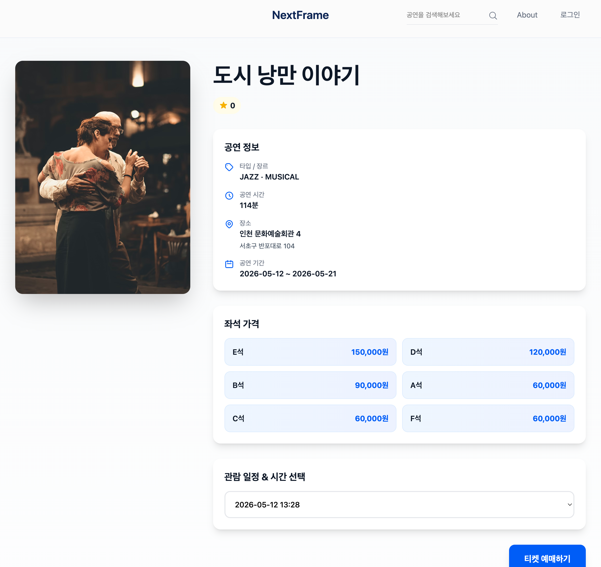
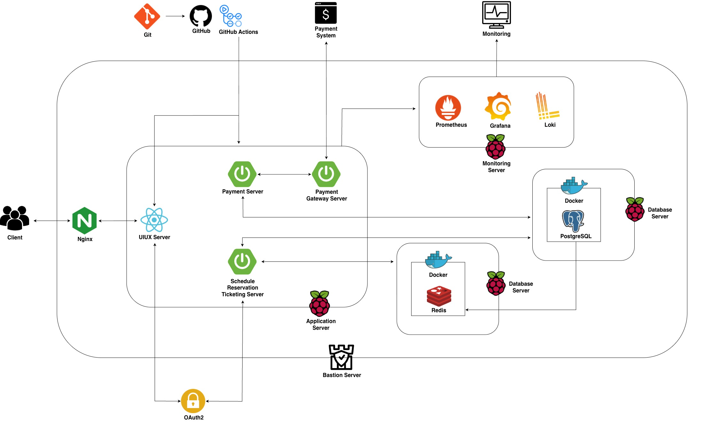

## 서비스 설명

보고 싶은 공연의 좌석을 선택해 예매하고, 예매가 완료되면 QR 티켓을 발급받아 현장에서 바로 입장할 수 있는 공연 예매 서비스입니다.

인기 공연은 예매 오픈 시점에 짧은 시간 동안 트래픽이 급격히 몰리는 특성이 있어, 이런 환경에서도 안정적으로 동작하는 시스템을 만드는 것을 이 프로젝트의 기술적 목표로 잡고 진행했습니다.

4인 팀(Frontend 2명, Backend 2명)으로 진행했으며, 그중 Backend로 인증·예매 도메인 설계 및 API 개발을 담당했습니다.

| 구분 | 상세 기술 |
| --- | --- |
| Infra & OS | Raspberry Pi 4, Linux(Ubuntu) |
| Backend | Java 21, Spring Boot 3.5.4 |
| Frontend | React |
| Database | PostgreSQL, Redis |
| DevOps | Nginx(Reverse Proxy), GitHub Actions |
| Monitoring | Prometheus, Grafana, Loki |

<figure>

<figcaption>홈페이지</figcaption>

</figure>

<figure>

<figcaption>공연 예매 페이지</figcaption>

</figure>

## 서비스 구조

짧은 시간 동안 트래픽이 급격히 몰리는 예매 오픈 환경에서도 안정적으로 서비스를 운영하기 위해, 역할별로 서버를 분리하고 안정적으로 배포·모니터링할 수 있는 구조를 구성했습니다.

### 인프라 구성

Spring Boot 기반 서비스들을 Systemd로 구동하는 Application Server, 영구 저장소인 PostgreSQL과 분산 락·캐싱 용도의 Redis를 각각 Docker로 운영하는 Database Server, Prometheus·Grafana·Loki로 구성된 Monitoring Server로 역할을 분리했습니다. 서버 역할을 나눠 각 컴포넌트가 독립적으로 확장·재시작될 수 있도록 구성했습니다.

### 서비스 구성

Nginx 리버스 프록시를 단일 진입점으로 두어 React 정적 파일을 서빙하고, 요청 경로에 따라 아래 3개 서버로 라우팅합니다.

| 서버 | 역할 |
| --- | --- |
| Schedule Reservation Ticketing Server | 공연 일정 조회, 좌석 예매, 티켓 발급 처리 |
| Payment Server | 결제 요청 처리 및 결제 상태 관리 |
| Payment Gateway Server | 외부 PG사 연동 로직 캡슐화 |

### CI/CD 파이프라인

모노레포 멀티모듈 구조에서 변경된 모듈만 감지해 조건부로 빌드·배포하도록 구성해 GitHub Actions 리소스를 절약했습니다. 배포는 Bastion Server를 경유하는 SSH 터널링을 통해 내부망으로만 접근할 수 있도록 구성했고, 라즈베리파이 환경에 맞춰 경량 JAR 배포와 Systemd 자동 재기동으로 운영 부담을 최소화했습니다.

### 모니터링

Prometheus·Grafana·Loki를 통해 하드웨어 메트릭, JVM 지표, 애플리케이션 로그를 한 곳에서 시각화하고, API 응답 시간과 서버 리소스를 실시간으로 추적해 병목 지점을 파악할 수 있는 체계를 구축했습니다.
