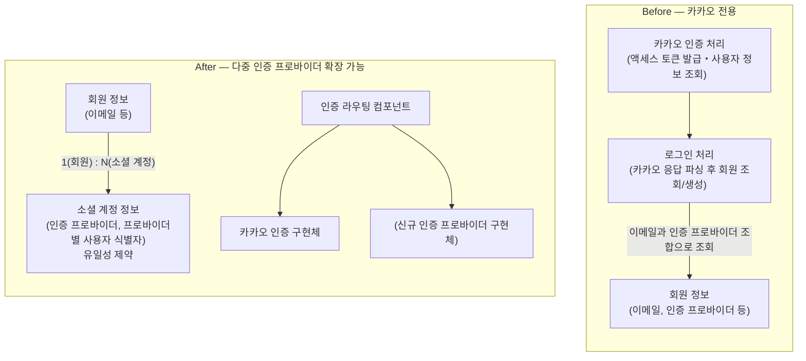

## 문제 정의

기존 인증 구조는 카카오 로그인만 지원하는 것을 전제로, 회원 정보가 인증 프로바이더를 직접 보유하고 있었습니다. 소셜 계정을 구분할 별도의 식별자 컬럼 없이 이메일과 인증 프로바이더 조합만으로 사용자를 특정했기 때문에, 동일한 이메일이라도 인증 프로바이더가 다르면 별도의 회원 레코드가 생성되는 구조였습니다. 카카오로 가입한 사용자가 이후 다른 인증 프로바이더로 로그인하면, 같은 사람임에도 신규 회원이 새로 생성되어 계정이 분리되는 문제가 발생합니다.

## 해결 방안 비교 및 선택 이유

회원 정보가 인증 프로바이더를 직접 갖는 구조를 개선하는 방법으로 세 가지를 검토했습니다.

**후보 A: 회원 테이블에 인증 프로바이더별 컬럼 추가** — 구현은 가장 단순하지만, 인증 프로바이더가 늘어날 때마다 회원 테이블에 컬럼을 추가하는 스키마 변경이 매번 필요하고, 대부분의 로우에서 나머지 프로바이더 컬럼은 NULL로 남아 테이블이 계속 넓어집니다.

**후보 B: 회원 테이블에 JSON 컬럼으로 인증 프로바이더-식별자 맵 저장** — 스키마 변경 없이 인증 프로바이더를 늘릴 수 있지만, 인증 프로바이더와 프로바이더별 사용자 식별자 조합의 유일성을 DB 제약으로 강제할 수 없습니다. 이 유일성이 깨지면 한 소셜 계정이 여러 회원에 중복 연결될 수 있어, 애플리케이션 코드에서 별도로 유일성을 검증해야 합니다. 하지만 이 검증도 동시 요청 상황에서는 우회될 여지가 있습니다.

**후보 C: 소셜 계정 정보를 별도 엔티티로 분리(채택)** — 인증 프로바이더와 프로바이더별 사용자 식별자를 별도 테이블로 분리하고 회원 테이블과 N(소셜 계정):1(회원)로 연결하며, 그 조합에 유일성 제약을 DB 레벨에 겁니다. A, B 대비 두 가지를 결정적으로 확보할 수 있어 C를 선택했습니다:  
**(1)** 소셜 계정 중복 연결을 DB 유일성 제약으로 원천 차단할 수 있습니다.  
**(2)** 인증 프로바이더가 늘어나도 소셜 계정 테이블에 로우만 추가되면 되므로 회원 테이블 스키마 변경이 발생하지 않습니다.

## 문제 해결 과정

아래는 이번 리팩토링 전후의 구조 변화입니다.

**1) 회원 정보와 소셜 계정 정보 분리.** 회원 엔티티에서 인증 프로바이더 필드를 제거해 이름·이메일·생년월일·전화번호·프로필 이미지만 남는 순수 회원 정보로 축소했습니다. 대신 인증 프로바이더·프로바이더별 사용자 식별자·회원 참조로 구성된 소셜 계정 엔티티를 신설했습니다. 로그인 조회도 소셜 계정(인증 프로바이더, 프로바이더별 식별자) 우선 → 이메일 연동 → 신규 생성 순으로 바꿔, 인증 프로바이더가 달라도 이메일이 같으면 기존 회원에 연동되도록 했습니다.

**2) 인증 프로바이더 인터페이스 도입.** 분리 이전에는 카카오 전용 로직(액세스 토큰 발급, 사용자 정보 조회, 응답 파싱)이 인증 처리 로직 여러 곳에 산재되어 있었고, 인증 요청을 받는 컨트롤러도 카카오 전용 요청 타입에 의존하고 있었습니다.

이를 "인증 프로바이더별 사용자 정보 조회" 메서드 하나만 정의한 인증 프로바이더 인터페이스로 추상화하고, 카카오 전용 로직은 그 인터페이스의 구현체 하나로 캡슐화했습니다.

인증 라우팅을 담당하는 컴포넌트는 인증 프로바이더 이름을 키로 각 구현체를 자동 주입받아, 요청받은 프로바이더에 맞는 구현체로 로그인 요청을 위임하는 역할만 담당하도록 정리했습니다. 또한 인증 프로바이더에 무관한 사용자 정보 DTO를 신설해, 로그인 처리 로직이 카카오 응답 타입을 더 이상 알지 못하게 했습니다.

## 결과

리팩토링 이후 구조에서 신규 인증 프로바이더를 추가하려면, 인증 프로바이더 인터페이스를 구현하는 클래스 하나(메서드 하나만 구현)를 만들고 스프링 빈으로 등록하는 것만으로 끝납니다. 인증 라우팅 컴포넌트는 구현체를 자동 주입받으므로 신규 프로바이더가 추가돼도 코드 변경이 필요 없고, 로그인 처리 로직과 소셜 계정 엔티티 쪽도 프로바이더 종류에 의존하지 않는 구조라 마찬가지로 변경할 필요가 없습니다. 즉 새 프로바이더 추가는 인증 프로바이더 인터페이스 구현체 신설 한 지점으로 좁혀집니다.
