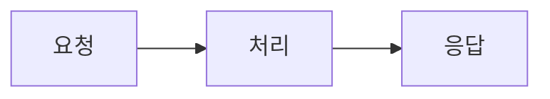

## 문제 정의

[이 프로젝트를 시작하게 된 배경과, 해결하려던 문제가 무엇인지 구체적으로 적어주세요. 어떤 상황에서 어떤 불편함이나 제약을 발견했는지 적으면 좋습니다.]

## 해결 방안 비교 및 선택 이유

[고려했던 여러 해결 방안을 나열하고, 각각의 장단점을 비교한 뒤, 왜 최종적으로 이 방법을 선택했는지 적어주세요.]

- 방안 A: [설명]
- 방안 B: [설명]
- 최종 선택: [선택한 방안과 그 이유]

## 문제 해결 과정

[실제로 구현하면서 겪은 과정을 단계별로 적어주세요. 이미지나 다이어그램은 아래처럼 필요할 때만 선택적으로 추가하면 됩니다.]

<!-- 이미지 예시 (클릭하면 확대되는 라이트박스가 자동으로 적용됩니다):

-->

<!-- Mermaid 다이어그램 예시:

-->

## 결과

[프로젝트를 통해 얻은 결과를 적어주세요. 가능하다면 수치나 구체적인 변화(성능 개선, 사용자 반응 등)로 표현하면 더 좋습니다.]
