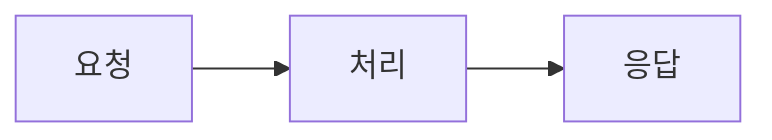

## 서비스 설명

[이 프로젝트/서비스가 무엇인지, 어떤 문제를 해결하는지, 누가 어떤 상황에서 사용하는지 소개해주세요.]

## 서비스 구조

[서비스의 전체적인 아키텍처/구조를 설명해주세요. 이미지나 다이어그램은 아래처럼 필요할 때만 선택적으로 추가하면 됩니다.]

<!-- 이미지 예시 (클릭하면 확대되는 라이트박스가 자동으로 적용됩니다):

-->

<!-- Mermaid 다이어그램 예시:

-->
