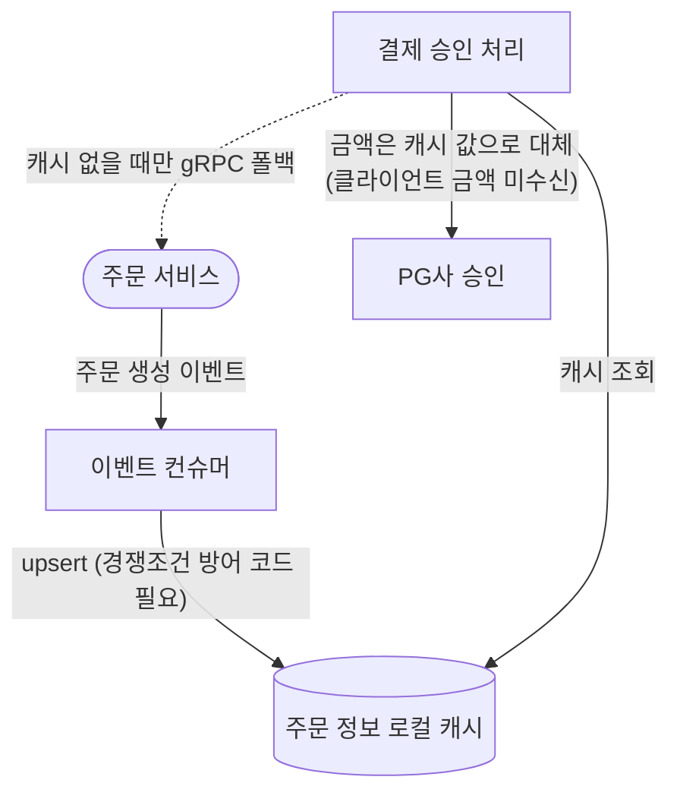
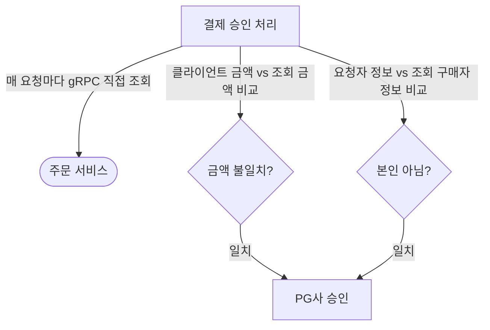

결제 승인 처리가 주문의 금액·구매자를 검증하는 근거를 로컬 캐시에서 매 요청 gRPC 직접조회로 바꾼 작업입니다. 주문 서비스 데이터를 로컬에 복제해두는 캐시를 만들어 붙였다가, 그 복제 구조 자체가 유지보수 대상이 되어버린 것을 확인하고 캐시를 통째로 걷어내 매 요청 gRPC 직접조회로 전환했습니다.

## 문제 정의

재설계 이전의 결제 승인 처리는 두 가지를 검증 없이 그대로 받아들였습니다.

- **금액**: 클라이언트가 보낸 결제 금액을 아무 확인 없이 그대로 PG사로 전달했습니다. 금액의 진실 공급원이 사실상 클라이언트였다는 뜻입니다. 프론트엔드 버그나 조작된 요청으로 실제 주문 금액과 다른 값이 오더라도 서버는 이를 걸러낼 방법이 없었습니다.
- **구매자**: 결제 승인 요청자가 실제 그 주문의 구매자인지 확인하는 절차가 없었습니다. 주문 식별자와 결제 키만 알면 다른 사람의 주문도 결제 승인을 시도할 수 있는 구조였습니다.

두 문제 모두 원인이 같았습니다 — 서버 쪽에 주문에 대한 독립적인 진실 공급원이 없었습니다. 그래서 이 작업의 실제 논점은 "검증 로직을 추가한다"가 아니라, "무엇을 기준(source)으로 검증할지를 먼저 정한다"였습니다.

## 해결 방안 비교 및 선택 이유

### 방안 A — 주문 정보 로컬 캐시 (먼저 도입)

주문 서비스가 발행하는 주문 생성 이벤트를 이벤트 컨슈머가 구독해 로컬 캐시 테이블에 미리 채워두고, 결제 승인 시점엔 이 로컬 스냅샷만 조회하는 방식입니다. 이벤트가 아직 도착하지 않았을 때만 gRPC로 폴백해 즉시 채워넣는 두 갈래 경로였습니다.

스냅샷을 유일한 진실 공급원으로 삼았기 때문에, 금액은 "비교"가 아니라 "대체"로 다뤘습니다 — 클라이언트 요청에서 금액 필드 자체를 완전히 제거하고, 스냅샷에 저장된 금액을 그대로 썼습니다. 같은 이유로 구매자 확인도 클라이언트가 주장하는 값이 아니라 스냅샷에 저장된 구매자 정보를 기준으로, 요청자 정보와 비교하는 방식으로 구현했습니다.

### A의 문제

이 로컬 캐시는 주문 서비스의 데이터를 결제 서비스 내부에 그대로 복제해둔 사본입니다. 이 복제 구조는 세 가지 문제를 낳았습니다.

- **강결합**: 결제 서비스가 주문 서비스의 데이터 구조를 통째로 끌어안게 됐습니다 — 주문 서비스가 이벤트 payload의 필드를 바꾸거나 발행 시점을 바꾸면, 결제 서비스의 캐시 테이블과 그걸 채우는 소비 로직도 함께 따라 바뀌어야 합니다.
- **최신성**: 주문 정보가 바뀌면 결제 서비스에서 알 수 없어 업데이트할 수 없습니다.
- **동시성**: 이벤트 중복 도착이나 이벤트·gRPC 두 경로의 동시 쓰기처럼 고려해야 할 경쟁조건이 많았습니다.

### 방안 B — 매 요청 gRPC 직접조회 (재설계)

로컬 복제를 없애고, 결제 승인이 호출될 때마다 주문 서비스를 gRPC로 직접 조회해 그 시점의 금액·구매자 정보를 받습니다. 그리고 클라이언트 요청에 금액을 다시 받되, 이번엔 그 값을 신뢰하지 않고 조회 결과와 비교하는 검증 대상으로 다룹니다(불일치 시 금액 불일치 에러 응답). 구매자 확인도 같은 조회 결과의 구매자 정보와 비교합니다(불일치 시 본인 주문 아님 에러 응답).

### 뒷받침 결정 — 금액을 다시 받기로 한 이유

어차피 매 요청마다 주문 서비스를 직접 조회하게 됐으니, A처럼 서버가 가진 값으로 조용히 대체할 수도 있었습니다. 하지만 그렇게 하면 클라이언트가 실제로 어떤 금액을 인지하고 있었는지에 대한 신호가 사라집니다. 클라이언트 값을 다시 받아 명시적으로 비교하면, 프론트엔드 버그나 화면-서버 금액 불일치를 관측 가능한 에러 신호로 드러낼 수 있습니다 — 대체는 문제를 숨기고, 비교는 문제를 드러낸다는 차이입니다.

### 선택 이유 — 트레이드오프 비교

- A가 아끼려던 것은 주문 정보를 주문 서비스로부터 받아와 검증하는 비용입니다. 하지만 이 비용은 크지 않았고, A가 발생시킨 비용(주문 서비스 데이터 구조에 대한 강결합, 그리고 스냅샷을 불변 데이터로 취급하며 감수한 최신성 문제)은 캐시를 없애면 그 자체로 완전히 사라지는 종류였습니다. 아끼는 비용은 작고 발생시키는 비용은 없앨 수 있다는 비대칭이 B를 택한 핵심 근거입니다.
- B가 받아들인 대가는 주문 서비스 가용성에 대한 동기 의존입니다. 이 gRPC 호출에는 서킷브레이커·재시도·벌크헤드 같은 회복탄력성 계층이 전혀 없는 순수 blocking 호출입니다(PG사 결제 승인 호출 쪽에는 별도로 서킷브레이커·벌크헤드·레이트리미터·재시도 4단 회복탄력성 계층을 갖춰둔 것과 대조적입니다). 주문 서비스가 느려지거나 응답하지 않으면 결제 승인은 즉시 주문 정보 조회 실패 에러로 막힙니다. A였다면 이벤트가 이미 도착해 스냅샷이 있는 경우엔 주문 서비스 장애와 무관하게 결제 승인이 계속 동작했을 상황이라, "데이터 복제로 인한 결합"을 "가용성 의존으로 인한 결합"으로 옮긴 것에 가깝습니다. 다만 주문 서비스는 외부 PG사가 아니라 같은 서비스 메시 안의 내부 서비스이고, 지금 시점엔 이 의존을 감수할 만하다고 판단했습니다. 주문 서비스 장애가 실제로 반복되면 이 지점에 회복탄력성 계층을 추가하는 것이 다음 후속 작업이 될 것입니다.

## 문제 해결 과정

운영하며 방안 A(로컬 캐시)의 복제 구조가 주문 서비스와의 강결합, 그리고 스냅샷의 최신성 문제로 이어지는 것을 확인했고, "캐시가 아끼는 비용 vs 캐시가 발생시키는 비용"을 다시 계산해 재설계에 착수했습니다. 구현 순서는 다음과 같았습니다.

1. 결제 승인 요청에 금액 필드를 다시 추가(A에서는 완전히 제거했던 필드).
2. 금액 불일치 에러를 추가하고, 결제 승인 로직을 "매 요청 gRPC 조회 + 명시적 비교"로 재작성.
3. 로컬 캐시 관련 코드 전부 제거 — 도메인 엔티티·리포지토리·영속성 어댑터, 그리고 이벤트 컨슈머의 캐시 저장 경로.
4. 마이그레이션 도구로 캐시 테이블을 drop.

테스트도 같은 방향으로 전환했습니다. 기존엔 테스트 컨테이너로 띄운 메시지 브로커에 주문 생성 이벤트를 직접 발행해 캐시 저장을 검증하는 방식이었는데, 캐시가 없어지면서 gRPC 조회 부분을 목(mock)으로 대체해 응답을 직접 통제하는 통합 테스트로 다시 짰습니다. 이 과정에서 금액불일치·본인아님 케이스를 신규로 추가했습니다.

## 결과

- **구조적**: 로컬 캐시 엔티티·리포지토리·영속성 어댑터, 그리고 이를 채우기 위한 두 갈래 쓰기 경로(이벤트 소비 + gRPC 폴백)와 그 경쟁조건 방어 코드가 전부 사라졌습니다. 결제 승인이 참조하는 주문 정보의 소스가 "로컬에 복제된 사본"에서 "그 순간 주문 서비스가 답하는 값" 하나로 줄었습니다.
- **기능적**: 금액은 대체가 아니라 비교 대상이 됐습니다(불일치 시 금액 불일치 에러). 구매자 확인도 같은 gRPC 조회 결과의 구매자 정보로 이뤄져(불일치 시 본인 주문 아님 에러), "금액을 어디서 검증하느냐"와 "본인 여부를 어디서 검증하느냐"가 같은 호출 하나로 합쳐졌습니다.
- **받아들인 비용**: 주문 서비스 장애 시 결제 승인이 즉시 실패하는 경로가 새로 생겼습니다 — 이전엔 이벤트가 이미 도착해 스냅샷이 있으면 주문 서비스 장애와 무관하게 동작했을 케이스입니다. 이 gRPC 호출에는 아직 회복탄력성 계층이 없어, 주문 서비스 장애 상황에서의 대응은 현재 "즉시 실패, 재시도는 클라이언트에 맡긴다" 수준에 머물러 있습니다.
