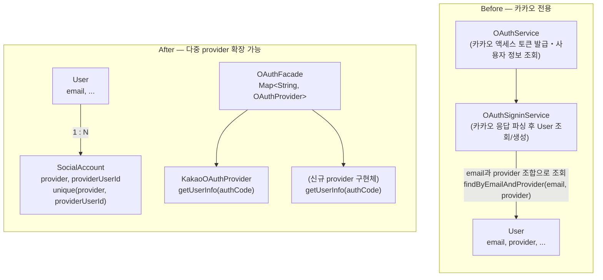

## 문제 정의

기존 인증 구조는 카카오 로그인만 지원하는 것을 전제로, `User` 엔티티가 `provider`를 직접 보유하고 있었습니다. 소셜 계정을 구분할 별도의 식별자 컬럼 없이 email과 provider 조합만으로 사용자를 특정했기 때문에, 동일한 이메일이라도 provider가 다르면 별도의 `User` 레코드가 생성되는 구조였습니다. 카카오로 가입한 사용자가 이후 다른 provider로 로그인하면, 같은 사람임에도 신규 `User`가 새로 생성되어 계정이 분리되는 문제가 발생합니다.

## 해결 방안 비교 및 선택 이유

`User`가 인증 수단을 직접 갖는 구조를 개선하는 방법으로 세 가지를 검토했습니다.

**후보 A: `User`에 provider별 컬럼 추가**(`kakaoId`, `googleId` ...) — 구현은 가장 단순하지만, provider가 늘어날 때마다 `User` 테이블에 컬럼을 추가하는 스키마 변경이 매번 필요하고, 대부분의 로우에서 나머지 provider 컬럼은 NULL로 남아 테이블이 계속 넓어집니다.

**후보 B: `User`에 JSON 컬럼으로 provider-식별자 맵 저장** — 스키마 변경 없이 provider를 늘릴 수 있지만, `(provider, provider_user_id)` 조합의 유일성을 DB 제약으로 강제할 수 없습니다. 이 유일성이 깨지면 한 소셜 계정이 여러 `User`에 중복 연결될 수 있어, 애플리케이션 코드에서 별도로 유일성을 검증해야 하고 동시 요청 시 검증을 우회할 여지가 생깁니다.

**후보 C: `SocialAccount` 엔티티 분리(채택)** — `provider`, `providerUserId`를 별도 테이블로 빼고 `User`와 N:1로 연결하며, `unique(provider, provider_user_id)` 제약을 DB 레벨에 겁니다. A, B 대비 두 가지를 결정적으로 확보할 수 있어 C를 선택했습니다: **(1)** 소셜 계정 중복 연결을 DB 유일성 제약으로 원천 차단할 수 있고, **(2)** provider가 늘어나도 `SocialAccount` 로우만 추가되면 되므로 `User` 테이블 스키마 변경이 발생하지 않습니다.

## 문제 해결 과정

아래는 이번 리팩토링 전후의 구조 변화입니다.

**1) `User`-`SocialAccount` 분리.** `User`에서 `provider` 필드를 제거해 이름·이메일·생년월일·전화번호·프로필 이미지만 남는 순수 회원 정보로 축소하고, `SocialAccount`(`provider`, `providerUserId`, `user` FK)를 신설했습니다. 로그인 조회도 `SocialAccount`(provider, providerUserId) 우선 → 이메일 연동 → 신규 생성 순으로 바꿔, provider가 달라도 이메일이 같으면 기존 `User`에 연동되도록 했습니다.

**2) `OAuthProvider` 인터페이스 도입.** 분리 이전에는 카카오 전용 로직(액세스 토큰 발급, 사용자 정보 조회, 응답 파싱)이 `OAuthService`와 `OAuthSigninService`에 산재되어 있었고, `AuthController`도 카카오 전용 요청 타입(`KaKaoSigninRequest`)에 의존하고 있었습니다. 이를 `getUserInfo(authCode)` 하나만 정의한 `OAuthProvider` 인터페이스로 추상화하고, 카카오 전용 로직은 `KakaoOAuthProvider` 구현체(`@Component("kakao")`)로 캡슐화했습니다. `OAuthFacade`는 `Map<String, OAuthProvider>`(Spring이 빈 이름을 키로 자동 주입)로 provider를 조회해 `signin(provider, authCode)` 요청을 위임하는 역할만 담당하도록 정리했고, provider에 무관한 `OAuthUserInfo` DTO를 신설해 `OAuthSigninService`가 카카오 응답 타입을 더 이상 알지 못하게 했습니다.

## 결과

리팩토링 이후 구조에서 신규 provider를 추가하려면, `OAuthProvider` 인터페이스를 구현하는 클래스 하나(메서드 1개 `getUserInfo(authCode)` 구현)를 만들고 스프링 빈으로 등록하는 것만으로 끝납니다. `OAuthFacade`는 `Map<String, OAuthProvider>`로 구현체를 자동 주입받으므로 신규 provider가 추가돼도 코드 변경이 필요 없고, `OAuthSigninService`와 `SocialAccount` 쪽도 provider 종류에 의존하지 않는 구조라 마찬가지로 변경할 필요가 없습니다. 즉 새 provider 추가는 `OAuthProvider` 구현체 신설 한 지점으로 좁혀집니다.
